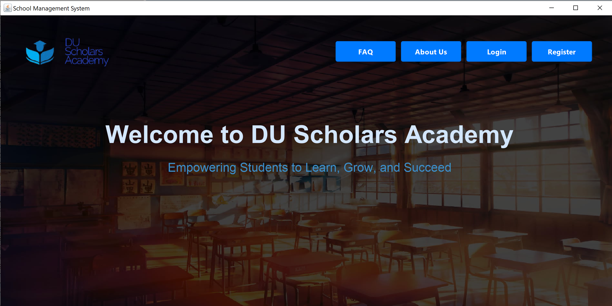
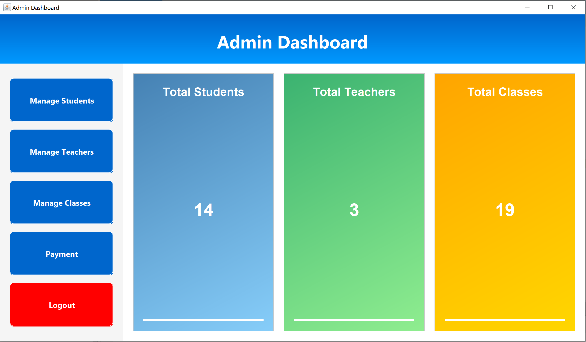
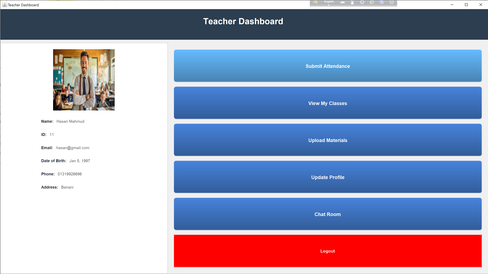
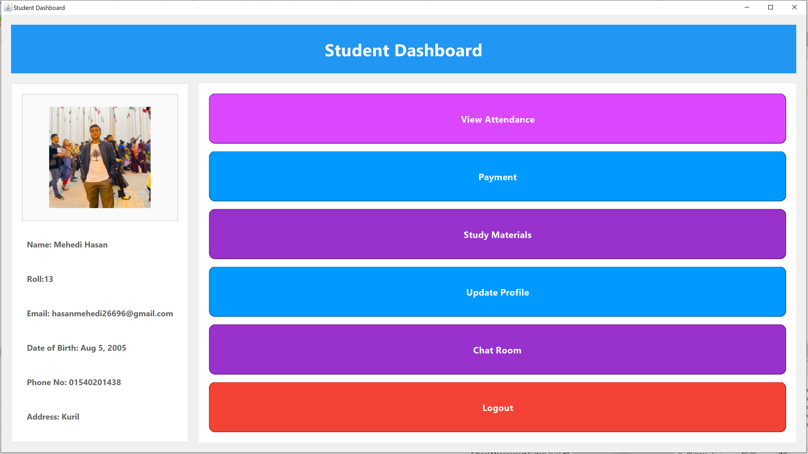

# School Management System

## Overview
The **School Management System** is an Object-Oriented Programming (OOP) based project designed to efficiently manage school operations for **admins, teachers, and students**. This system includes features like **user authentication, student and teacher management, attendance tracking, fee payment processing, study material sharing, and real-time chat**. Built with **Java Swing for UI**, **MySQL for database management**, and **Apache Ant for project build automation**, this system ensures modularity, scalability, and a seamless user experience.

### **Homepage Preview**


---

## Technologies Used
### **Programming & IDE**
- **Java (JDK 22)**
- **NetBeans IDE**
- **Apache Ant** (Build automation tool)

### **Database**
- **MySQL** for data storage and retrieval

### **UI Libraries & Tools**
- **Java Swing** for graphical user interface
- **JCalendar** for date selection
- **iText** for PDF generation

### **Networking**
- **Socket Programming** for real-time chat
- **Multithreading** for concurrent message handling

---

## Installation Guide
### **Prerequisites**
- Install **Java JDK 22**
- Install **NetBeans IDE**
- Set up **MySQL Server**
- Ensure **Apache Ant** is configured in NetBeans

### **Steps to Set Up the Project**
1. **Clone the Repository**
   ```bash
   git clone https://github.com/Mehedi26696/2nd-Year-1st-Semester-Java-OOP.git
   ```
2. **Import Project into NetBeans**
   - Open NetBeans and select **Open Project**.
   - Navigate to the cloned folder and open the project.

3. **Set Up MySQL Database**
   - Create a new MySQL database:
     ```sql
     CREATE DATABASE schoolmanagementsystem;;
     ```
   - Import the provided `School_Management_System.sql` file:
     ```bash
     mysql -u root -p schoolmanagementsystem; < School_Management_System.sql
     ```
   - Update **database credentials** in `DBConnection.java`:
     ```java
     String url = "jdbc:mysql://localhost:3306/schoolmanagementsystem;";
     String username = "root";
     String password = "your_password";
     ```

4. **Run the Project**
   - In NetBeans, select **Run Project** (Apache Ant will handle the build and execution).

5. **Another Way to Run the Project**
   - Download the `dist` folder from the repository.
   - Open a terminal and navigate to the `dist` folder.
   - Run the JAR file using the following command:
     ```bash
     java -jar School_Management_System.jar
     ```
   - Ensure you have **JDK 22** installed on your system to run the JAR file.
6. **For Chat Room Feature**
   - To use the chatroom feature, you need to manually run the `ChatServer.java` file. Once the server is running, you can access and use the chatroom feature.
---

## Features
### **Admin Panel**
- **User Management:** Add, update, and remove students and teachers.
- **Class & Course Management:** Assign teachers to classes.
- **Fee Management:** Set payment amounts, track due payments, and generate receipts.
- **Report Generation:** Export reports using **iText PDF library**.

### **Teacher Panel**
- **Attendance Management:** Submit and view attendance.
- **Study Material Upload:** Share PDFs, images, and documents.
- **Chat System:** Real-time communication with students.

### **Student Panel**
- **Attendance & Grades:** View attendance records and grades.
- **Study Resources:** Access uploaded materials.
- **Fee Payment:** Calculate fees, make payments, and download receipts.
- **Chat System:** Interact with teachers.

### **Additional Features**
- **FAQ Chatbot:** Uses **socket programming** for automated responses.
- **Real-time Chat:** Implements **multithreading and sockets** for instant communication.
- **User-Friendly UI:** Developed with **Swing components and JCalendar for date selection**.

---

## Screenshots
Below are screenshots of different sections of the application:






---

## Contributors
- **[Mehedi26696](https://github.com/Mehedi26696)**
- **[Abs-Futy7](https://github.com/Abs-Futy7)**
---

## Troubleshooting
1. **Database Connection Issues**
   - Ensure **MySQL is running** and credentials are correct.
   - Verify that **MySQL JDBC driver** is properly configured.

2. **Build Errors in NetBeans**
   - Ensure **Apache Ant is installed and configured**.
   - Check if all required JAR files (**JCalendar, iText**) are properly added to the project.

3. **Chat Not Working**
   - Verify that the **server is running** before starting the client.
   - Ensure **port 7777** is not blocked by a firewall.

---

## Future Enhancements
- **Multi-Semester Support** to track long-term student progress.
- **Online Payment Integration** for easier transactions.
- **Mobile Application** for better accessibility.
- **Role-Based Access Control (RBAC)** for improved security.

---

## License
This project is licensed under the [MIT License](LICENSE).

---

Thank you for using the **School Management System**!

